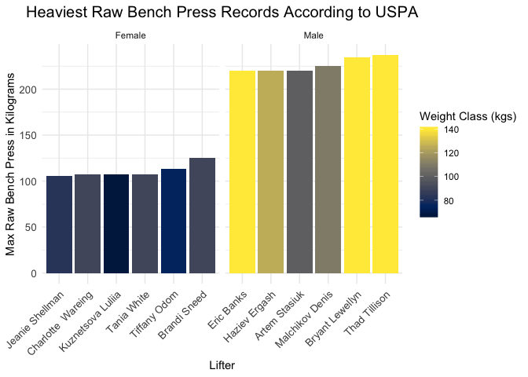

Bench\_Press\_raw
================
Stephen Powers
10/18/2019

``` r
records = 
  read_csv("./Powerlifting.csv") %>% 
    janitor::clean_names() %>% 
    select(-region, -tested, -group) %>% 
    filter(lbs > 0) %>% 
    mutate(sub_group = str_remove(sub_group, "OPEN")) %>% 
    mutate(sub_group = str_remove(sub_group, "MASTER")) %>% 
    mutate(sub_group = str_remove(sub_group, "JUNIOR")) %>% 
    separate(weight_class, into = c("weightclass_kg" , "weightclass_lbs"), sep = "/") %>% 
    mutate(sub_group = str_to_lower(sub_group)) %>% 
    separate(sub_group, into = c("Gender" , "Age"), sep = "[:digit:]", extra = "merge") %>% 
    mutate(Gender = trimws(Gender, "r")) %>% 
    mutate(as.character(Gender), 
    gender = ifelse(grepl("women", Gender), "Female",
       ifelse(grepl("men", Gender), "Male"))) %>% view
```

    ## Parsed with column specification:
    ## cols(
    ##   region = col_character(),
    ##   tested = col_character(),
    ##   group = col_character(),
    ##   sub_group = col_character(),
    ##   weight_class = col_character(),
    ##   lift = col_character(),
    ##   member_name = col_character(),
    ##   kgs = col_double(),
    ##   lbs = col_double(),
    ##   record_date = col_character()
    ## )

    ## Warning: Expected 2 pieces. Missing pieces filled with `NA` in 18 rows [1,
    ## 2, 3, 4, 5, 6, 7, 8, 9, 10, 89, 90, 91, 92, 93, 94, 95, 96].

``` r
records %>% 
   mutate(
    weightclass_kg = as.numeric(gsub("[kg - +kg]", "", weightclass_kg)), 
    weightclass_lbs = as.numeric(gsub("lb", "", weightclass_lbs))) %>% 
  group_by(gender) %>% 
  mutate(rank = min_rank(desc(kgs))) %>% 
  filter(rank < 7) %>% 
  ggplot(aes(x = reorder(member_name, kgs), 
             y = kgs, 
             group = gender, 
             fill = weightclass_kg,)) +  
  geom_col(position = "dodge") +
  facet_grid(~gender, scales = "free") +
  theme_minimal() +
  viridis::scale_fill_viridis(
          option = "cividis",
        name = "Weight Class (kgs)",
        ) +
  ggtitle("Heaviest Raw Bench Press Records According to USPA") +
  xlab("Lifter") +
  ylab("Max Raw Bench Press in Kilograms") +
  theme(axis.text.x = element_text(size = 10, angle = 45, hjust = 1), 
        axis.text.y = element_text(size = 10),
        plot.title = element_text(size = 15, hjust = .5))
```

<!-- -->
